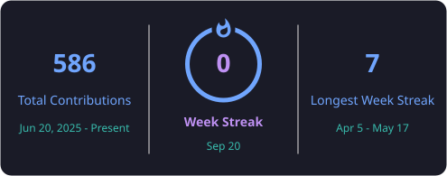

<!-- ========================================================= -->
<!--                         HERO                              -->
<!-- ========================================================= -->

  

  

  

  
  &nbsp;
  
  &nbsp;
  
  &nbsp;
  

  

 

<!-- ========================================================= -->
<!--                         WHO AM I                           -->
<!-- ========================================================= -->

<h2 align="left">👨‍💻 whoami</h2>

  

  

 

  
  &nbsp;&nbsp;
  
  &nbsp;&nbsp;
  

  <b>Full Stack Developer</b>
  &nbsp; • &nbsp;
  <b>Expert MERN Stack Developer</b>
  &nbsp; • &nbsp;
  <b>Android & iOS Developer</b>

  <b>DevOps</b>
  &nbsp; • &nbsp;
  <b>AI / ML</b>
  &nbsp; • &nbsp;
  <b>Cybersecurity Learner</b>

 

  

---

# ⚡ Skills

## 🌐 Full Stack Development

  

  <b>Frontend</b>
  &nbsp; • &nbsp;
  <b>Backend</b>
  &nbsp; • &nbsp;
  <b>REST APIs</b>
  &nbsp; • &nbsp;
  <b>Authentication</b>
  &nbsp; • &nbsp;
  <b>Database Architecture</b>

  

---

## 🍃 Expert MERN Stack Developer

  

  <b>MongoDB</b>
  &nbsp; × &nbsp;
  <b>Express.js</b>
  &nbsp; × &nbsp;
  <b>React.js</b>
  &nbsp; × &nbsp;
  <b>Node.js</b>

  

---

## 📱 Android & iOS Development

  
  &nbsp;&nbsp;&nbsp;&nbsp;
  
  
  

  <b>Android</b>
  &nbsp; • &nbsp;
  <b>iOS</b>
  &nbsp; • &nbsp;
  <b>Mobile Applications</b>

  

---

## ☁️ DevOps

  

  <b>Cloud</b>
  &nbsp; • &nbsp;
  <b>Containers</b>
  &nbsp; • &nbsp;
  <b>Linux</b>
  &nbsp; • &nbsp;
  <b>Deployment</b>
  &nbsp; • &nbsp;
  <b>Infrastructure</b>
  &nbsp; • &nbsp;
  <b>CI/CD</b>

  

---

## 🤖 AI / ML

  

  <b>Machine Learning</b>
  &nbsp; • &nbsp;
  <b>Deep Learning</b>
  &nbsp; • &nbsp;
  <b>Computer Vision</b>
  &nbsp; • &nbsp;
  <b>Data Science</b>

  

---

# 💻 Languages I Know

  
  &nbsp;&nbsp;
  

  <b>C / C++</b>
  &nbsp; • &nbsp;
  <b>Python</b>
  &nbsp; • &nbsp;
  <b>JavaScript</b>
  &nbsp; • &nbsp;
  <b>TypeScript</b>
  &nbsp; • &nbsp;
  <b>Swift</b>
  &nbsp; • &nbsp;
  <b>Java</b>

---

# 🐍 Python Ecosystem

  
  &nbsp;
  
  &nbsp;
  
  &nbsp;
  

  
  &nbsp;
  
  &nbsp;
  
  &nbsp;
  
  &nbsp;
  

  <b>NumPy</b> &nbsp;•&nbsp;
  <b>Pandas</b> &nbsp;•&nbsp;
  <b>Scikit-learn</b> &nbsp;•&nbsp;
  <b>SciPy</b> &nbsp;•&nbsp;
  <b>TensorFlow</b> &nbsp;•&nbsp;
  <b>PyTorch</b> &nbsp;•&nbsp;
  <b>Keras</b> &nbsp;•&nbsp;
  <b>OpenCV</b> &nbsp;•&nbsp;
  <b>Matplotlib</b>

  

---

# 🔐 Currently Learning — Cybersecurity

  

  
  &nbsp;&nbsp;&nbsp;
  
  &nbsp;
  
  &nbsp;
  

  <b>Network Security</b>
  &nbsp; • &nbsp;
  <b>Linux & System Security</b>
  &nbsp; • &nbsp;
  <b>Web Application Security</b>
  &nbsp; • &nbsp;
  <b>Ethical Hacking</b>
  &nbsp; • &nbsp;
  <b>Cloud Security</b>

  

---

# 📊 GitHub Analytics

  
  &nbsp;&nbsp;
  

  

---

# 🔥 Contribution Streak

  

---

# 📈 Contribution Activity

  

---

# 🐍 Contribution Snake

  <picture>
    <source media="(prefers-color-scheme: dark)" srcset="https://raw.githubusercontent.com/KavyaPatel21190607/KavyaPatel21190607/output/github-contribution-grid-snake-dark.svg">
    <source media="(prefers-color-scheme: light)" srcset="https://raw.githubusercontent.com/KavyaPatel21190607/KavyaPatel21190607/output/github-contribution-grid-snake.svg">
    
  </picture>

---

# 🤝 Connect With Me

  

 

  

  

